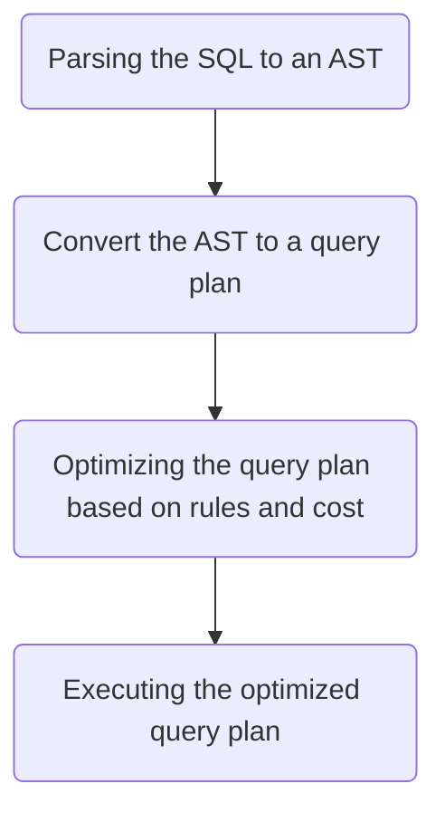
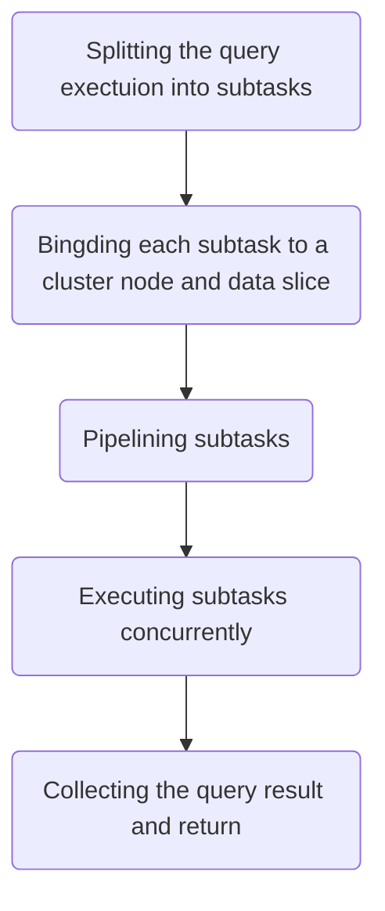
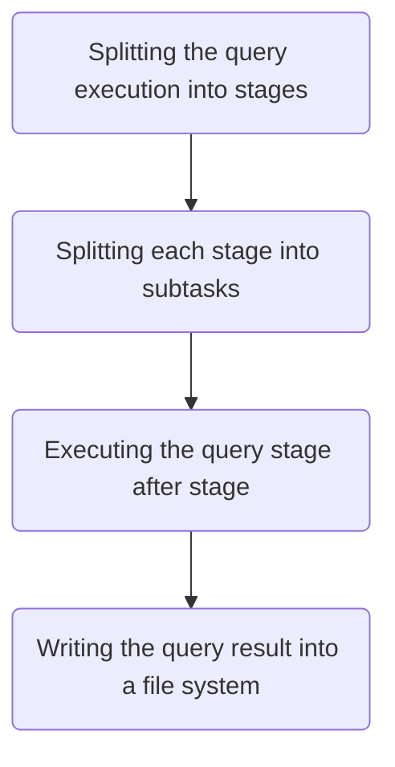

# Introduction

In the world of big data processing, two giants have emerged to tackle the colossal task of handling and analyzing massive datasets: Massively Parallel Processing (MPP) and MapReduce. Both of these paradigms offer unique solutions to the challenges posed by the ever-growing volume of data. In this tech blog, we'll delve into the intricacies of MPP and MapReduce, comparing their strengths and weaknesses to help you choose the right tool for your data processing needs.

# MPP

MPP(Massively Parallel Processing) is a computing architecture for processing and analyzing large datasets in a distributed computing environment, which is commonly used in the context of data warehousing. MPP systems are designed to handle complex queries with high performance by distributing data and processing tasks across multiple nodes in a cluster. 

## Why MPP?

### High Performance

MPP systems are optimized for performance, especially when it comes to complex analytical queries. They can handle queries that involve large datasets, aggregations, joins, and other data manipulations with low-latency responses, making them ideal for business intelligence and data warehousing tasks. High performance should be the most valuable feature of MPP.

### Complex Query Support

MPP databases are well-suited for executing complex SQL queries such as the [TPCDS](https://www.tpc.org/tpcds/) queries. This makes them valuable for organizations that need to perform advanced data analytics.

## How does an MPP SQL Query Engine Work?

### The Life of a SQL

The MPP features are applied to the final phase, in which the query execution is split into many subtasks to be executed concurrently.

### Query Execution

Each subtask is bound to a process/thread on a cluster node and a data slice on a distributed file system such as S3. The subtasks are pipelined without any barrier. The pipeline could be push-based or pull-based and the latter is more common in real systems (e.g. the Volcano execution model).

### Data Exchange

With push-based pipeline, the computing result of each subtask is pushed to the target subtask. With pull-based pipeline, the computing result of each subtask is pulled from the target subtask.

There are serveral ways to do data-exchange

- hash-based exchange

  Determine the target subtask based on a hash value computed from the key column(s).

- sort-based exchange

  Determine the target subtask based on the range of the key column(s).

## Drawbacks of MPP

### Bucket Effect

As each subtask is bound to a specific cluster node and data slice, it is impossible to re-schedule a subtask to be executed on another cluster node or data slice if the subtask execution is slower than expected. This leads to the bucket effect, where the slowest subtask will determine the duration of the entire ditributed query.

### Limited Scalability

Because of the bucket effect we mentioned in previous paragraph, if the cluster grows larger, there will be a greater chance to have some slow tasks which slow down the entire query.

### Problems with Heavy Queries

MPP systems always rely on a large memory since performance is so critical. So if a query input or output a very large dataset, the query will be more likely to fail.

### Poor Concurrency

Each query submitted to a MPP system will be distributed across the whole cluster. So the system can't handle too many concurrent queries or the cluster resources will be saturated soon and the system might freezes for a period of time, which could be a disaster to your business.

## Open Source MPP-based SQL Query Engines and Databases

- SQL Query Engines
  - [Trino](https://github.com/trinodb/trino)
  - [Impala](https://github.com/apache/impala)

- Databases
  - [ClickHouse](https://github.com/ClickHouse/ClickHouse)
  - [Greenplum](https://github.com/greenplum-db/gpdb)
  - [HAWQ](https://github.com/apache/hawq)

# MapReduce

Just like MPP systems, MapReduce systems are also widely used for analyzing large datasets in the context of data warehousing. And they also distribute data and tasks across clusters, but with a different computing model.

## Why MapReduce?

### Theoretically Unlimited Horizontal Scalability

### Stability

### Capacity of Handling Heavy Queries

## How does a MapReduce SQL Query Engine Work?

### Query Execution

Just like MPP SQL query engines, the execution phase is where MapReduce fits into.

However, a MapReduce system will create a barrier between subtasks when there needs a data-exchange, the more generic term for which is shuffle. The MapReduce system splits a query into stages with shuffles as boundaries at first, and then execute the query stage after stage. Each stage has a set of subtasks. The computing result of each stage could be output to both memory and disks. One stage cannot be started until the previous stage is completed. So the subtasks are not pipelined like what MPP systems do.

## Drawbacks of MapReduce

### Lower Performance

## Open Source MapReduce-based SQL Query Engines

- [Hive](https://github.com/apache/hive)
- [Spark SQL](https://github.com/apache/spark)

# When to Choose MPP or MapReduce?

- Choose MPP if your queries match the following conditions

  - Performance outweighs fault tolerance
  - A limited size of dataset is returned from a single query. A good example is a top-N query
  - The queries are for real-time analytics mainly rather than persisting to a distributed storage system(e.g. S3, GCS, HDFS)

- Choose MapReduce if your queries match the following conditions

  - Fault tolerance outweighs performance
  - A large size of datasets is returned from a single query. For example, ETL/ELT queries
  - You always need to persist the query result to a distributed storage system(e.g. S3, GCS, HDFS)

# References