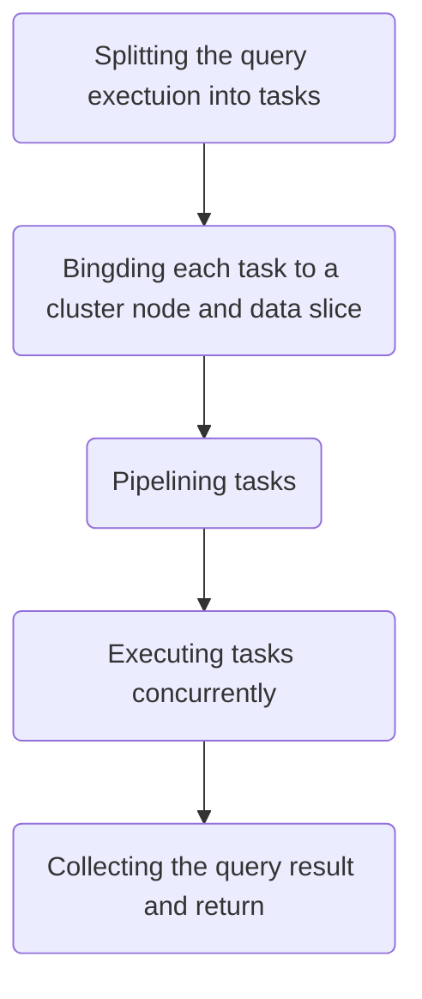
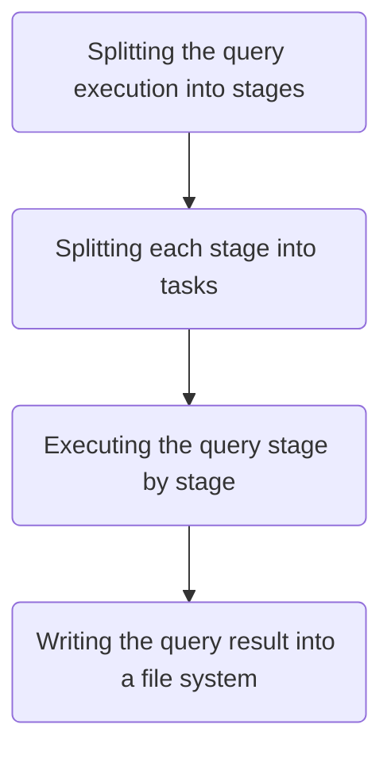

# Introduction

In the world of big data processing, two giants have emerged to tackle the colossal task of handling and analyzing massive datasets: Massively Parallel Processing (MPP) and MapReduce. Both of these paradigms offer unique solutions to the challenges posed by the ever-growing volume of data. In this tech blog, we'll delve into the intricacies of MPP and MapReduce, comparing their strengths and weaknesses to help you choose the right tool for your data processing needs.

## Terms

- **Executor** - A group of tasks to execute a relational algebra operator
- **Task** - A process or thread to process a data partition
- **Stage** - Comes from [Apache Spark](https://github.com/apache/spark). A group of Executors that don't do data-exchange between cluster nodes. For example, a group with Executors of `Projection` and `Selection`

# MPP

MPP(Massively Parallel Processing) is a computing architecture for processing and analyzing large datasets in a distributed computing environment, which is commonly used in the context of data warehousing. MPP systems are designed to handle complex queries with high performance by distributing data and processing tasks across multiple nodes in a cluster. 

## How MPP Works for SQL Execution

Each task is bound to a process/thread on a cluster node and a data slice on a distributed file system such as S3. The tasks are pipelined without any barrier. The pipeline could be push-based or pull-based and the latter is more common in real systems (e.g. the Volcano execution model).

### Data Exchange

Generally, there are 2 kinds of pipeline for MPP -- push-based pipeline and pull-based pipeline. With push-based pipeline, the computing result of each task is pushed to the target task. With pull-based pipeline, the computing result of each task is pulled from the target task.

If we are dealing with queries which don't need to shuffle data between tasks, the result data of each task will just be transfered to a task of the next executor on the same cluster node. Or we will need to do data-exchange between cluster nodes via network.

There are serveral ways to do data-exchange between MPP tasks (each task could be either a process or a thread), and here we just talk about the following ways

- hash-based exchange

  Determine the target task based on a hash value computed from the key column(s).

- sort-based exchange

  Determine the target task based on the range of the key column(s).

## Pros & Cons of MPP

### Pros

- **High Performance:** MPP systems are optimized for performance, especially when it comes to complex analytical queries. They can handle queries that involve large datasets, aggregations, joins, and other data manipulations with low-latency responses, making them ideal for business intelligence and data warehousing tasks. High performance should be the most valuable feature of MPP

- **Complex Query Support:** MPP databases are well-suited for executing complex SQL queries such as the [TPCDS](https://www.tpc.org/tpcds/) queries. This makes them valuable for organizations that need to perform advanced data analytics

### Cons

- **Limited Scalability:** As each task is bound to a specific cluster node and data slice, it is impossible to re-schedule a task to be executed on another cluster node or data slice if the task execution is slower than expected. This leads to the bucket effect, where the slowest task will determine the duration of the entire ditributed query. So if the cluster grows larger, there will be a greater chance to have slow tasks which slow down the entire query execution

- **Poor Fault Tolerance:** MPP has no strong fault-tolerance mechanism to handle failed tasks. It always tend to retry the entire query execution since the execution is very fast to complete or fail

## MPP SQL Engines and Databases

- SQL Engines
  - [Trino](https://github.com/trinodb/trino)
  - [Impala](https://github.com/apache/impala)

- Databases
  - [ClickHouse](https://github.com/ClickHouse/ClickHouse)
  - [Greenplum](https://github.com/greenplum-db/gpdb)
  - [HAWQ](https://github.com/apache/hawq)

# MapReduce

Just like MPP systems, MapReduce systems are also widely used for analyzing large datasets in the context of data warehousing. And they also distribute data and tasks across clusters, but with a different computing model.

## How MapReduce Works for SQL Engine

However, a MapReduce system will create a barrier between tasks when there needs a data-exchange, the more generic term for which is shuffle. The MapReduce system splits a query into stages with shuffles as boundaries at first, and then execute the query stage after stage. Each stage has a set of tasks. The computing result of each stage could be output to both memory and disks. One stage cannot be started until the previous stage is completed. So the tasks are not pipelined like what MPP systems do.

## Pros & Cons of MapReduce

### Pros

- **Theoretically Unlimited Horizontal Scalability:** As MapReduce is able to migrate slow tasks to another cluster node, there's no bucket effect. So the performance grows nearly linearly as the cluster scales out

- **Fault Tolerance:** MapReduce retries failed tasks or stages rather than the entire execution to ensure that the cost can be as little as possible. Even if a cluster node is down, it is able to migrate tasks to other nodes

### Cons

- **Lower Performance:** As the MapReduce tasks are not pipelined and they are divided into stages and executed stage by stage, the performance of the entire query can be lower than MPP at most time

## MapReduce SQL Engines

- [Hive](https://github.com/apache/hive)
- [Spark SQL](https://github.com/apache/spark)

# When to Choose MPP or MapReduce?

- Choose MPP if your queries match the following conditions

  - Performance outweighs fault tolerance
  - A limited size of dataset is returned from a single query. A good example is a top-N query
  - The queries are for real-time analytics mainly rather than persisting to a distributed storage system(e.g. S3, GCS, HDFS)

- Choose MapReduce if your queries match the following conditions

  - Fault tolerance outweighs performance
  - A large size of datasets is returned from a single query. For example, ETL/ELT queries
  - You always need to persist the query result to a distributed storage system(e.g. S3, GCS, HDFS)
